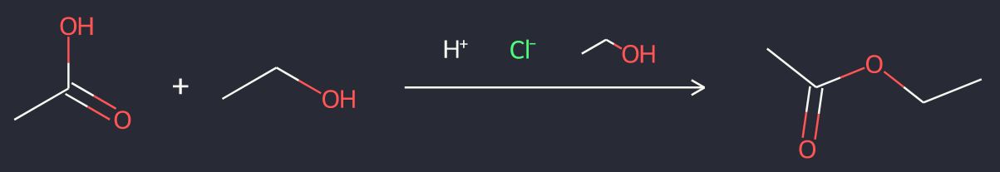

#### RDKit-Powered Reaction Classification and Yield Prediction using the Differential Reaction Fingerprint DRFP

---

#### Reaction SMILES
```python
rxn_smiles = "CC(=O)O.OCC>[H+].[Cl-].OCC>CC(=O)OCC"
rxn = AllChem.ReactionFromSmarts(rxn_smiles, useSmiles=True) # Thanks @iwatobipen
d2d = dark_mode(MolDraw2DSVG(1024, 300))
d2d.DrawReaction(rxn)
d2d.FinishDrawing()
SVG(d2d.GetDrawingText())
```


