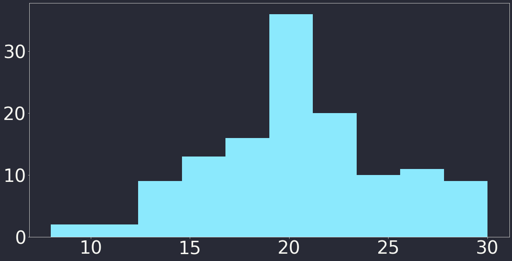

#### RDKit-Powered Reaction Classification and Yield Prediction using the Differential Reaction Fingerprint DRFP

---

#### Reaction SMILES

```python
rxn_smiles = "CC(=O)O.OCC>[H+].[Cl-].OCC>CC(=O)OCC"
rxn = AllChem.ReactionFromSmarts(rxn_smiles, useSmiles=True) # Thanks @iwatobipen
d2d = dark_mode(MolDraw2DSVG(1024, 300))
d2d.DrawReaction(rxn)
d2d.FinishDrawing()
SVG(d2d.GetDrawingText())
```


---

#### Reaction SMILES - Everything is a Reactant<sup>1,2</sup>

```python
rxn_smiles = "CC(=O)O.OCC.[H+].[Cl-].OCC>>CC(=O)OCC"
rxn = AllChem.ReactionFromSmarts(rxn_smiles, useSmiles=True) # Thanks @iwatobipen
d2d = dark_mode(MolDraw2DSVG(1024, 300))
d2d.DrawReaction(rxn)
d2d.FinishDrawing()
SVG(d2d.GetDrawingText())
```


<sup>1</sup> except the product(s), of course
<sup>2</sup> and we don't need atom mappings either

---

#### What's in the Box?

```python
fps, mapping = DrfpEncoder.encode(rxn_smiles, mapping=True)
mols = [MolFromSmiles(s) for smileses in mapping.values() for s in smileses]
SVG(MolsToGridImage(mols, molsPerRow=7, useSVG=True))
```


---

#### Show us the Code!

```python
left = sides[0].split(".")
right = sides[2].split(".")

left_shingles = set()
right_shingles = set()
```
...
```python
s = right_shingles.symmetric_difference(left_shingles)
```

---

#### The Roof, the Roof, ...
```python
for ring in AllChem.GetSymmSSSR(in_mol):
```
...
```python
for i, atom in enumerate(in_mol.GetAtoms()):
```
...
```python
for index, _ in enumerate(in_mol.GetAtoms()):
    for i in range(1, radius + 1):
        p = AllChem.FindAtomEnvironmentOfRadiusN(in_mol, i, index)
```

---

#### Hash

```python
s = right_shingles.symmetric_difference(left_shingles)
```
...
```python
hash_values = []
for t in shingling:
    hash_values.append(int(blake2b(t, digest_size=4).hexdigest(), 16))

return np.array(hash_values, dtype=np.int32)
```

---

#### Fold
```python
return np.array(hash_values, dtype=np.int32)
```
...
```python
folded = np.zeros(length, dtype=np.uint8)
on_bits = hash_values % length
folded[on_bits] = 1

return folded, on_bits
```

---

#### That's it... But there's more!

```python
fps, mapping = DrfpEncoder.encode(rxn_smiles, mapping=True)
```
...
```python
def encode(X: Union[Iterable, str], ...):
    for _, x in enumerate(X):
        if mapping:
            for i, folded_index in enumerate(on_bits):
                result_map[folded_index].add(
                    smiles_diff[i].decode("utf-8")
                )
```

---

#### Example

```python
smiles = []
url = ("https://raw.githubusercontent.com/reymond-group/"
       "drfp/main/notebooks/reaction_smiles.csv")
with urlopen(url) as f:
    smiles = [line.strip().decode("utf-8") for line in f]

fps, mapping = DrfpEncoder.encode(smiles, mapping=True, n_folded_length=128)

n_grams_per_bin = [len(value) for value in mapping.values()]
print(f"There are {sum(n_grams_per_bin)} unique molecular n-grams.")
```
`> There are 2610 unique molecular n-grams.`

---

### Example

```python
plt.hist(n_grams_per_bin)
```



---

#### Example

```python
for d in [256, 512, 1024, 2048]:
    fps, mapping = DrfpEncoder.encode(smiles, mapping=True, n_folded_length=d)
    n_grams_per_bin = [len(value) for value in mapping.values()]
    plt.hist(n_grams_per_bin)
    plt.title(f"Bin occupation for d={d}")
    plt.show()
```