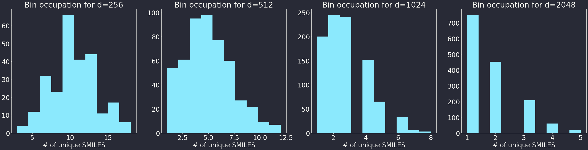

#### RDKit-Powered Reaction Classification and Yield Prediction using the Differential Reaction Fingerprint DRFP


Disclaimer:
- This work is part of my PhD project (Reymond Group, University of Bern)
- Co-authors: Philippe Schwaller, Jean-Louis Reymond
- Current Position: Research scientist @ IBM Research


---

#### Spoilers


<span style="font-size:0.5em">Schwaller, P.; Probst, D.; Vaucher, A. C.; Nair, V. H.; Kreutter, D.; Laino, T.; Reymond, J.-L., Nat Mach Intell 2021</span>
<span style="font-size:0.5em;">Schneider, N.; Lowe, D. M.; Sayle, R. A.; Landrum, G. A., J. Chem. Inf. Model. 2015</span>

---

#### Spoilers


---

#### Spoilers


<span style="font-size:0.5em">Schwaller, P.; Vaucher, A. C.; Laino, T.; Reymond, J.-L., Machine Learning: Science and Technology 2021, 2, 015016</span>
<span style="font-size:0.5em">Ahneman, D. T.; Estrada, J. G.; Lin, S.; Dreher, S. D.; Doyle, A. G., Science 2018</span>

---

#### Reaction SMILES

```python
rxn_smiles = "CC(=O)O.OCC>[H+].[Cl-].OCC>CC(=O)OCC"
rxn = AllChem.ReactionFromSmarts(rxn_smiles, useSmiles=True) # Thanks @iwatobipen
d2d = dark_mode(MolDraw2DSVG(1024, 300))
d2d.DrawReaction(rxn)
d2d.FinishDrawing()
SVG(d2d.GetDrawingText())
```


---

#### Reaction SMILES - Everything is a Reactant<sup>1,2</sup>

```python
rxn_smiles = "CC(=O)O.OCC.[H+].[Cl-].OCC>>CC(=O)OCC"
rxn = AllChem.ReactionFromSmarts(rxn_smiles, useSmiles=True) # Thanks @iwatobipen
d2d = dark_mode(MolDraw2DSVG(1024, 300))
d2d.DrawReaction(rxn)
d2d.FinishDrawing()
SVG(d2d.GetDrawingText())
```


<sup>1</sup>except the product(s), of course
<sup>2</sup>and we don't need atom mappings either

---

#### What's in the Box?

```python
fps, mapping = DrfpEncoder.encode(rxn_smiles, mapping=True)
mols = [MolFromSmiles(s) for smileses in mapping.values() for s in smileses]
SVG(MolsToGridImage(mols, molsPerRow=7, useSVG=True))
```


---

#### Show us the Code!

```python
left = sides[0].split(".")
right = sides[2].split(".")

left_shingles = set()
right_shingles = set()
```
...
```python
s = right_shingles.symmetric_difference(left_shingles)
```

---

#### The Roof, the Roof, ...
```python
for ring in AllChem.GetSymmSSSR(in_mol):
```
...
```python
for i, atom in enumerate(in_mol.GetAtoms()):
```
...
```python
for index, _ in enumerate(in_mol.GetAtoms()):
    for i in range(1, radius + 1):
        p = AllChem.FindAtomEnvironmentOfRadiusN(in_mol, i, index)
```

---

#### Hash

```python
s = right_shingles.symmetric_difference(left_shingles)
```
...
```python
hash_values = []
for t in shingling:
    hash_values.append(int(blake2b(t, digest_size=4).hexdigest(), 16))

return np.array(hash_values, dtype=np.int32)
```

---

#### Fold
```python
return np.array(hash_values, dtype=np.int32)
```
...
```python
folded = np.zeros(length, dtype=np.uint8)
on_bits = hash_values % length
folded[on_bits] = 1

return folded, on_bits
```

---

#### That's it... But there's more!

```python
fps, mapping = DrfpEncoder.encode(rxn_smiles, mapping=True)
```
...
```python
def encode(X: Union[Iterable, str], ...):
    for _, x in enumerate(X):
        if mapping:
            for i, folded_index in enumerate(on_bits):
                result_map[folded_index].add(
                    smiles_diff[i].decode("utf-8")
                )
```

---

#### Example

```python
smiles = []
url = ("https://raw.githubusercontent.com/reymond-group/"
       "drfp/main/notebooks/reaction_smiles.csv")
with urlopen(url) as f:
    smiles = [line.strip().decode("utf-8") for line in f]

fps, mapping = DrfpEncoder.encode(smiles, mapping=True, n_folded_length=128)

n_grams_per_bin = [len(value) for value in mapping.values()]
print(f"There are {sum(n_grams_per_bin)} unique molecular n-grams.")
```
`> There are 2610 unique molecular n-grams.`

---

### Example

```python
plt.hist(n_grams_per_bin)
```


---

#### Example

```python
for i, d in enumerate([256, 512, 1024, 2048]):
    fps, mapping = DrfpEncoder.encode(smiles, mapping=True, n_folded_length=d)
```



---

#### I Should have used TMAP...

```python
pca = PCA(n_components=2)
X = pca.fit(fps).transform(fps)
...
```


---

### Really should have...


---

#### Encore
```python
X, y = pickle.load(open("buchwald_hartwig.pkl", "rb"))
mapping = pickle.load(open("buchwald_hartwig.map.pkl", "rb"))
model = pickle.load(open("buchwald_hartwig_model.pkl", "rb")) # XGBRegressor
```
...
```python
explainer = shap.TreeExplainer(model)
shap_values = explainer.shap_values(X[:100])
shap.summary_plot(shap_values, X[:100])
```

---

#### Encore

```python
shap.force_plot(explainer.expected_value, shap_values[0,:], matplotlib=True)
```


---

#### Encore
```python
sub = list(mapping.get(760))[0].replace("c", "C")
MolFromSmiles(sub)
```


---

#### Thanks!

Thanks for listening!

Connect with me...
... on the blue bird network: @skepteis
... e-mail: dpr@zurich.ibm.com


Im currently working on...
... retrosynthetic pathway prediction for biocatalysed reactions 
(https://rxn.res.ibm.com/, preprint: https://bit.ly/BIOCATML)
